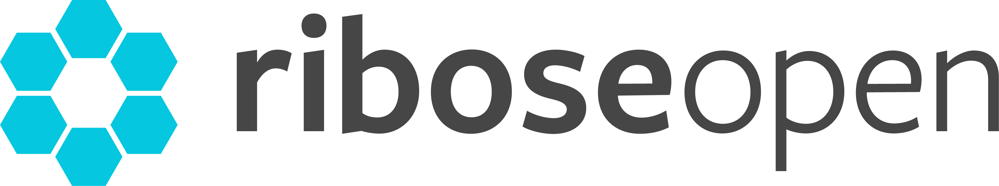

= Ribose Open site designs

This repo holds design artifacts for the Ribose Open sites, using an
"open design" process.

This document specifies the intention of the Ribose Open site and some
points of interest for the designer to consider.

== Introduction

The purpose of this site is to showcase and organize
Ribose-developed open source software and open specifications,
and information, news related to them.

NOTE: We found these designs appealing for this purpose:
http://beautifulopen.com

== Terms and definitions

Ribose open-sourced software::
  located at https://github.com/riboseinc/

Ribose Open Specification::
* Technical specifications that are published for interoperability
  purposes.
* These are new technologies that have not been published at official
  venues.
* By publishing these open specifications ourselves we allow others to
  adopt and improve on them.

Ribose Open Project::
* consists of at least one piece of open-sourced software, and zero or
  more open specifications.
* e.g., the StandardDocument project
  (https://github.com/riboseinc/isodoc) contains multiple pieces of
  software, like IsoDoc, CSD, GbDoc, etc; and zero (often one) or more
  open specifications

== Site Structure

=== Landing Page

The purpose of the "`Ribose Open`" landing page is to:

* highlight our commitment to open source and open specifications

* provide a list of open projects / open source projects
** (or a partial list, e.g., featured + pagination of complete list)

* link to our <<open-blog>> (or maybe visibility on the latest news?)

[[open-blog]]
=== Open Blog

* Each blog post is tagged to different project or project components
* A blog post could be news on an old or new project, new or updated
  software or specifications

=== Open Project Index

* List out all Open Projects

=== Open Project Individual Page

* List out all open source software and open specifications that relate
  / belong to this Open Project.
* blog that displays only blog posts about this project (i.e., link to
  Open Blog with a tag filter)

=== Open Source Software Index

* List of open source projects
* Each project with link to source code (e.g., GitHub)
* A project contains one or more open source code projects

=== Open Source Software Individual Page

* introduction
* installation
* usage
* development documentation (API Docs)
* link to source code, GitHub status like number of Stars, Pull Requests
* people who have adopted this

=== Open Specifications Index

* List of open specifications

=== Open Specifications Individual Page

* specification page (just like the CSD standard, a document with
  multiple sections)
* links to published documents like IETF drafts, or ISO documents
* development tools and documentation relating to this specification
* other people who have adopted this

== Available Assets

=== Ribose Open Logo

This is the logo for the hub site. PNG, SVG versions provided here.

== Copyright notice

Copyright of all content and assets. All rights reserved. Ribose Inc.
